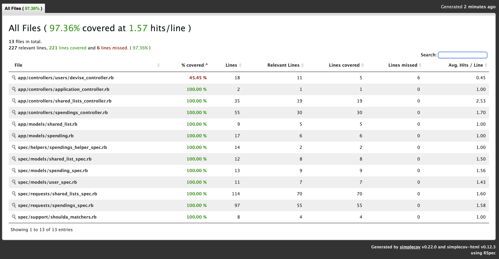
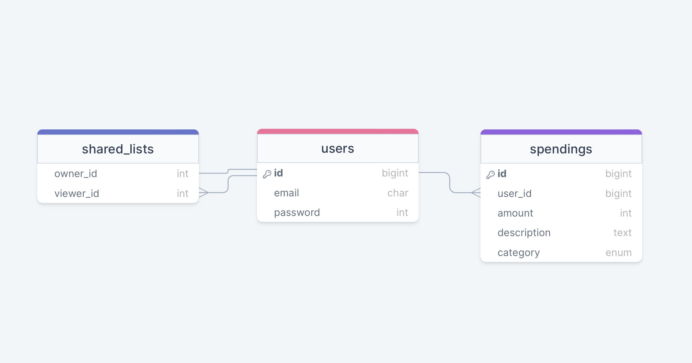
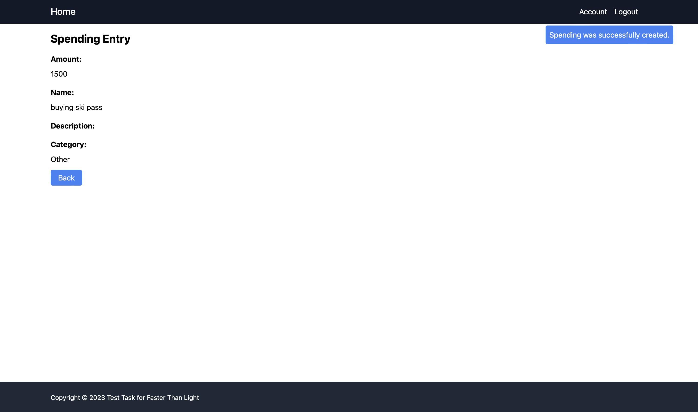
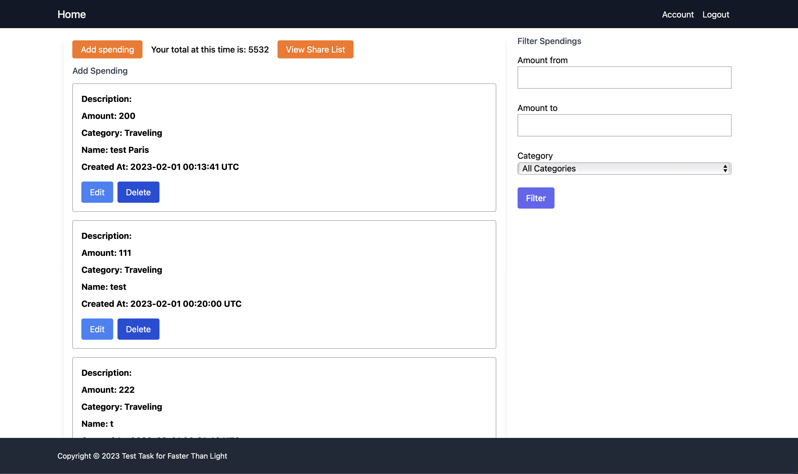
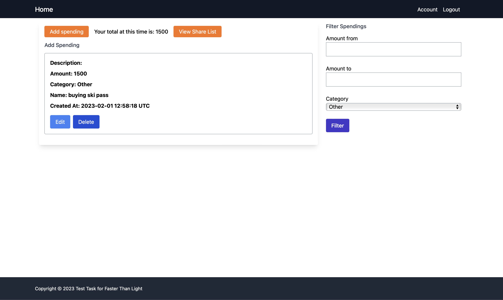
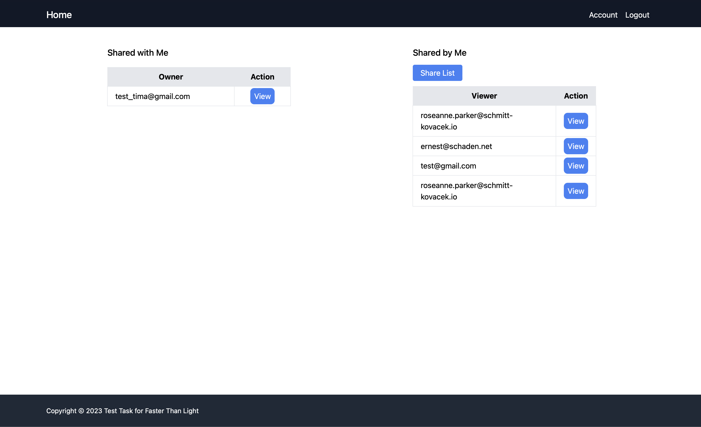
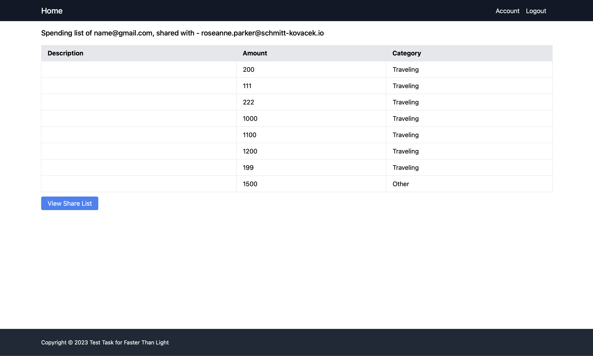
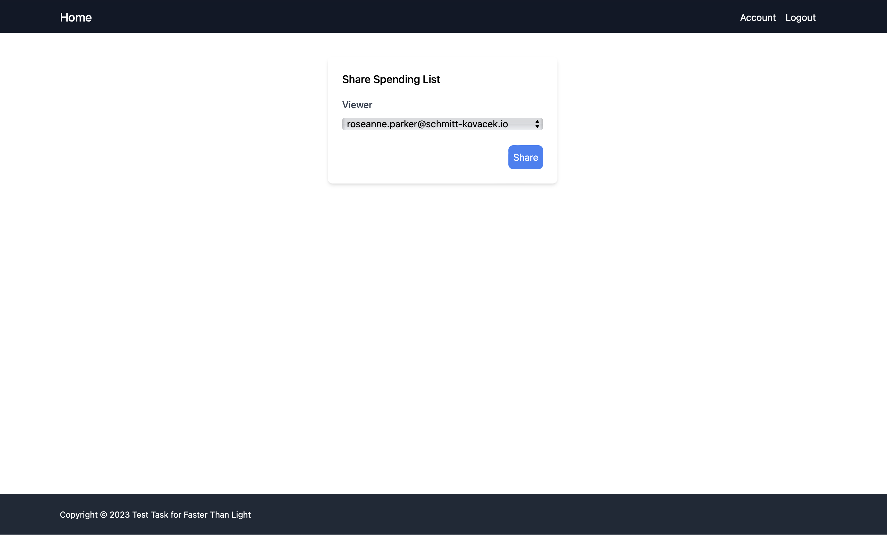

# README

# Faster Than Light task

## Used technologies:

### Backend part:
- `esbuild`
- ruby '3.2.0'
- gems rails, pg, rspec-rails, shoulda-matchers, factory_bot_rails, faker, pry, devise

### Frontend part:
- CSS - [tailwindCss](https://tailwindcss.com)

## How to run project:
1. Clone the repo:
```shell
git clone git@github.com:tymof1j/ftl_task_2try.git
```
2. Install gems:
```shell
bundle install
```
3. Create and migrate database:
```shell
rails db:create
rails db:migrate
```
4. Because I used `esbuild` in this project in order to run it you have to use command:
```shell
./bin/dev
```

### Test coverage:


### Structure of db:

- Amount, name, category are required fields for spendings table
- Description is optional

### Pictures from website:
  - Creation of spending.

  - Viewing all entries.

  - Viewing filtered entries.

  - Viewing sharing page.

  - Viewing show action of shared_list.

  - Sharing you spending list with someone.

